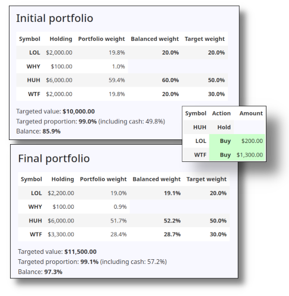

# Target Tiller

This is the **portfolio rebalancer** that eases you on target for any stage
of your investment journey.

**TL;DR** See also the [Getting it to work](#getting-it-to-work) section.
Look in the `demo` directory, the Jupyter notebook walks through some examples. 

You should have some target allocations that you would like your
portfolios to meet (eg., 50% of one fund, 30% or another, 20% for a third one).
"Portfolio rotation" is a method performed at semi-regular intervals to
make sure that your asset holdings match these target proportions.

A question you might want to ask: do you need to meet those targets
today, or is it okay to reach them gradually over time as you either
grow your portfolio (for example through monthly contributions), or start
funding your life through periodic withdrawls? If you have the time,
this software might be a good fit for your financial journey.



This is why this software is called a "tiller": it steers your asset
proportions toward your targets, rather than teleporting them there
immediately (but if you wish it can also be told to take you directly
to your targets).

If you would like to know more about portfolio rebalancing, I
would recommend you search for information on the "Couch Potato Strategy",
which uses periodic rebalancing to grow wealth over time, typically
through the acquisition of index funds.

**Warning: This software only suggests purchases and sales, based
on some parameters you feed it, it doesn't do the work for you.
You assume any risk involved if you follow the suggestions.
The software is for informational purposes only,
and can not be held liable for any loses you may make on your
investment journey. The only goal of the software is to suggest
ways that you can (eventually) keep your portfolio in balance
(via fairly basic math), it does not give suggestions on what
to buy/sell, nor does it advise on how you can make money.
This is possibly the least sexy form of investing known to man:
you should only follow this course if you want to "get rich slow"
(and the "get rich" part isn't guaranteed).**

## Three types of balancing

TargetTiller has three rebalancing options to reach your goals:

* **Buy-only**: this options is great for people in the accumulation
  stage of their lives: you tell the transaction calculator
  how much you would like to spend and it will only buy assets as
  it charts a course towards perfect balance based on your
  targets. This is also a great choice for accounts that are subject
  to capital gains taxes on the sale of assets.
  It may not get you there immediately, but it will
  send you in the right direction towards the target. If you
  spend enough money and if you spend enough times it will
  eventually get you in balance.

* **Sell-only**: this options is for people who are actively
  liquidating their wealth, an ideal option  to fund life
  in retirement. Here you tell the transaction calculator
  how much you would like to withdraw and it will only sell
  assets as it heads towards perfect balance based on your
  targets. Again, it may not get you there immediately,
  but it will send you in the right direction towards the target
  so that you will get their over time (or if you withdraw
  enough money).

* **Buy/sell**: this option is allowed to both buy and sell
  assets to try to keep your portfolio in balance. This
  is good for when you want to reach the targets quickly,
  often because your portfolio is much larger in size
  compared to the amounts you are either adding or removing
  from the portfolio (or maybe you aren't adding/removing
  money from the portfolio at all, and you just want to
  rebalance a static portfolio).

## Getting it to work

First you should ensure the requirements are installed.
A `requirements.txt` file is supplied, you should install
the package requirements from there, usually in a virtual
environment. Google will tell you how to do this if you
don't know already, but typically it looks like this:

```
# venv is the name/directory of the virtual environment
virtualenv --no-download venv

# Activate it, or it's not good for anything (you're prompt will change)
source venv/bin/activate

# Install the requirements
pip install -r requirements.txt

# With the virtual environment activated, do some things ...
# E.g., run the test suite
pytest

# E.g., start jupyter and play with the demo notebook
jupyter-notebook &

# E.g., run the demo script (--help for options)
python -m target_tiller --demo

# Deactivate the virtual environment
deactivate
```

## The engine ...

The work done by this software is performed by a "transactions
calculator" (via the class
**`target_tiller.TranscationsCalculator`**). This controls the
rebalancing analysis, provides access to the before and
after states of rebalancing, and keeps a list of transactions
needed to do the rebalancing. It provides the information
needed to report on the rebalancing activity.

In order to do the work, objects of this class need three
things:

* A set of targets (class **`target_tiller.Targets`**) that
  outline the proportions you would like to meet in the
  balanced part of your portfolio.
* A portfolio that has asset holdings and cash
  (class **`target_tiller.Portfolio`**). Some of the assets
  can be balanced through targets, while others you
  can leave only (the software will not make suggestions
  for these other assets).
* A configuration for the transactions to perform
  (class **`target_tiller.TransactionsConfig`**). This tells
  the transactions calculator what method to use
  (buy only, sell only, or buy/sell), the amount to
  add or remove from the assets (e.g., due to a deposit
  in the account, or due to withdrawl, or keep the amount
  of assets the same if you prefer),
  and the minimum/maximum values of any given transaction
  (e.g., some brokerages won't allow transactions less
  than $100 for some funds).

## Input/Output

The `target_tiller.input` and `target_tiller.output` module have
classes to handle loading and saving information from this
program. There is a class called `target_tiller.input.FilesHelper`
that helps find input files in standard places and can be configured
to find the files via environment variables. See the demo notebook
for some examples.

Most readers and writers operatate on YAML format (the notable exception
being a TD Webroker reader that understands CSV).

## Future extensions

This software only reads data you give it, and only reports on suggested
transactions, so an obvious extension is to grab the data from your
trading platform, and somehow upload the desired transactions there.
My online broker doesn't support these activities, so they don't
exist (and I would question letting a python script do transactions
on ones behalf without a human-involved sanity check first). Anyways,
there may be some ways to automate how data is retrieved, or how
transactions are performed.
